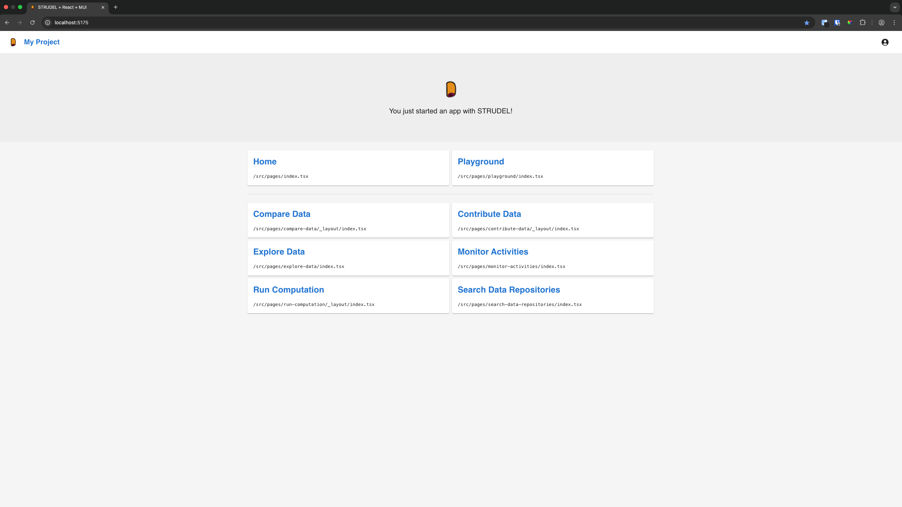
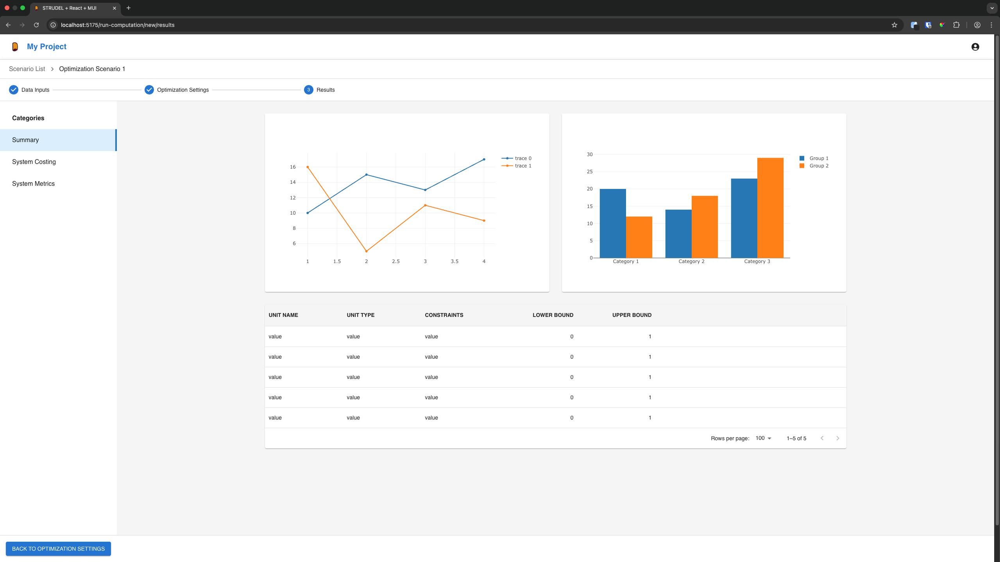

# STRUDEL Kit

STRUDEL Kit is a React and TypeScript-based starter kit for building scientific UIs based on the STRUDEL Design System and Task Flows. Visit [strudel.science](https://strudel.science) for more information about the STRUDEL project.

This library provides a suite of templates to implement UIs for various different task flows common to the scientific domain. The app is intended to be used as a starting point for building out a modern single-page web app for scientific-type UIs.

[Browse the full docs](https://strudel.science/strudel-kit/docs/)

## What's included?
- [**React**](https://react.dev/): A component-based JavaScript library for building UIs.
- [**TypeScript**](https://www.typescriptlang.org/): A typed superset of JavaScript that compiles to plain JavaScript.
- [**Vite**](https://vite.dev/): A fast, opinionated frontend build tool.
- [**Material UI**](https://mui.com/material-ui/getting-started/): Open-source React component library based on Google's Material Design.
- [**TanStack Router**](https://tanstack.com/router/latest): A fully type-safe router with built-in data fetching, first-class search-param APIs, and more.
- [**ESLint**](https://eslint.org/): The pluggable linting utility for JavaScript and JSX.
- [**Prettier**](https://prettier.io/): An opinionated code formatter.
- [**Husky**](https://typicode.github.io/husky/): Runs a pre-commit hook to lint and style staged code.
- [**Cypress**](https://www.cypress.io/): End-to-end tests for built-in templates.
- [**Task Flow Templates**](https://strudel.science/design-system/task-flows/overview/): Six template flows based on common patterns. 





## Getting Started

### Option 1: Use this template

Click the green "Use this template" button on the [strudel-kit GitHub page](https://github.com/strudel-science/strudel-kit). Create your own repository from the strudel-kit code and give it a name.

Clone the strudel-kit repository from your new repo.

### Option 2: degit

Generate a new project from strudel-kit using [degit](https://github.com/Rich-Harris/degit):
```
npx degit strudel-science/strudel-kit my-app
```

### Option 3: Fork this repo

Especially if you want to contribute back, you can click the Fork button to create a fork of this repo from the [strudel-kit GitHub page](https://github.com/strudel-science/strudel-kit).

Clone the strudel-kit repository from your new fork.

### Install and Start

Install the dependencies:

```
npm install
```

Start up the app:

```
npm start
```

Open [http://localhost:5175](http://localhost:5175) to view the app in the browser.

Begin modifying the templates in `src/pages`.

## Contributions

STRUDEL Kit welcomes contributions of all kinds! Learn how to submit suggestions and changes in [CONTRIBUTING.md](https://github.com/strudel-science/strudel-kit/blob/main/CONTRIBUTING.md).

## License 

This software is licensed through the [Lawrence Berkeley National Lab](https://www.lbl.gov/) and can be used, modified, and shared at absolutely no cost. [Read the full license](https://github.com/strudel-science/strudel-kit/blob/main/LICENSE).

## Attribution

We kindly ask that you take two steps to attribute this repo if you find it useful to your work:

1. Give us a star on our GitHub Page
2. Credit the STRUDEL project and strudel-kit repo in your README.

> This project utilized the [strudel-kit](https://github.com/strudel-science/strudel-kit/tree/main) repository. Read more about [STRUDEL](https://strudel.science).
